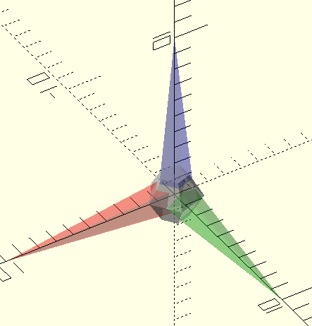
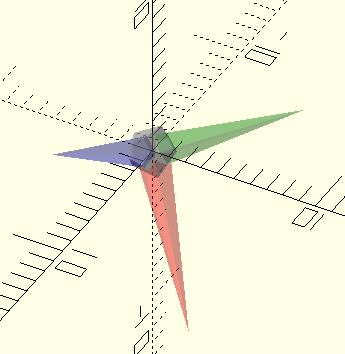
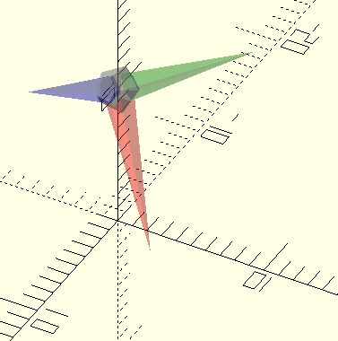
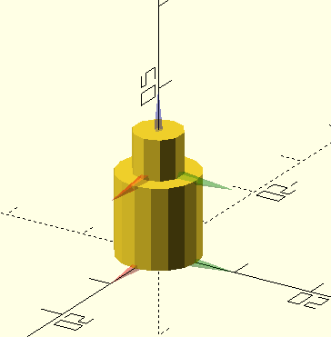

CORGIAXIS
=========

  

**CorgiAxis** is small tool to speed up the assembly in [OpenScad](https://openscad.org/) by introducing the concept of axis cloud, that can  be used for the realization of the parts, the assembly, even the animation (see examples). 

To be quick, the axis are points oriented in space that can be assigned to a module to apply constraints in translation or rotation 

What axis
----------

A axis is a single point in space with an orientation, so there are defined by a array of one point and one euler orientation:

<pre><code> ax = [[x,y,z],[rx,ry,rz]]</code></pre>

For examples:

<table align="center">
<tr>
   <td>
      <figure> 
      
      <figcaption ><b>[[0,0,0],[0,0,0]]</b></figcaption>
      </figure>
   </td>
   <td>
      <figure> 
      
      <figcaption ><b>[[0,0,0],[45,45,45]]</b></figcaption>
      </figure>
   </td>
   <td>
      <figure> 
      
      <figcaption ><b>[[0,0,10],[45,45,45]]</b></figcaption>
      </figure>
   </td>
</tr>
</table>

If needed it is possible to define a collection of axis, an axises, which is then defined as an axis list :

<pre><code> axs = [
   [[x,y,z],[rx,ry,rz]],
   [[x,y,z],[rx,ry,rz]]
   ]
</code></pre>

In general it is necessary to define a parametric axis using a function like this :

<pre><code>function axs(r_main = 10,h_main=3,r_stop=3)=
[
[[0,0,0],[0,0,0]],
[[0,r_main-r_stop,h_main],[0,0,0]],
];
</code></pre>
Why define axis
----------------

Because it's fun :smile: and we can easily define constraints between these axis.For example, we can force an axis to copy the orientation and/or the position of another axis.

The currently supported or envisaged constraints between axis are :

- [x] Axis copy another axis position 
- [x] Axis copy another axis orientation
- [x] Axis copy another axis position and orientation
- [x] Axis (z) targets another axis position
- [ ] Axis projection on one plane ((xy),(xz),(yz)) of another axis
- [ ] Axis projection on one of the lines (x,y or z) of another axis

Use of axis for design 
-----------------------

you can describe translation and rotation operations of a module from the point of view of an axis. to do this there are several steps:

   - it is necessary to define a module one with a system of axis attached to the desired point ex :

<pre><code>
/**
* Define the parts axises 
**/
function axs_parts02(h_main=3)=
[
[[0,0,0],[0,0,0]],
[[0,0,h_main],[0,0,0]],
];
/**
your module
**/
module parts02(
    r_main = 5,
    h_main = 10,
    r_stop = 3,
    h_stop = 5
){
    //generate the axises 
    axs = axs_parts02(h_main);
    
    emptys(axs); // use to plot axises

    ax_from_to(AX_NULL,axs[0])
    cylinder(h = h_main,r=r_main);
    ax_from_to(AX_NULL,axs[1])
    cylinder(h = h_stop,r=r_stop);

}
</code></pre>

we find ourselves with a piece with two axis that can be used to contract this module by using the modules and functions of axis.scad

<figure align="center"> 

<figcaption ><b>examples/parts02.scad</b></figcaption>
</figure>

Installation 
------------

1. Download the .zip or .tar.gz release file for this library.
2. Unpack it
3. Move the CORGIAXIS directory into the OpenSCAD library directory
   - Windows: My Documents\OpenSCAD\libraries\
   - Linux: $HOME/.local/share/OpenSCAD/libraries/
   - Mac OS X: $HOME/Documents/OpenSCAD/libraries/
5. Restart OpenSCAD.

